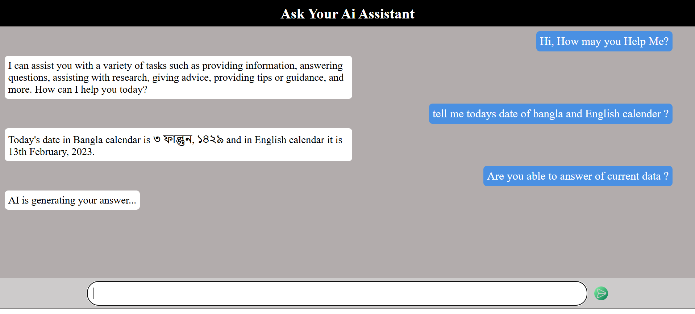

<h1 align="center">🤖 AI Chat Assistant</h1>

A simple <b>AI Chat Assistant Web Application</b> where users can ask questions and receive AI-generated responses instantly.
This project demonstrates how to connect a chat interface with an AI API using <b>HTML, CSS, and JavaScript</b>.

<h2>🌐 Live Website</h2>

<a href="https://chatt-gpt.netlify.app/">
https://chatt-gpt.netlify.app/
</a>

<h2>📌 Features</h2>

<ul>
<li>Simple AI chat interface</li>
<li>Fast response using API</li>
<li>AI-generated answers to user prompts</li>
<li>Send messages using <b>Enter key</b> or <b>Send button</b></li>
<li>Responsive layout</li>
<li>Clean and minimal UI</li>
</ul>

<h2>🛠 Technologies Used</h2>

<ul>
<li><b>HTML5</b></li>
<li><b>CSS3</b></li>
<li><b>JavaScript</b></li>
<li><b>Fetch API</b></li>
</ul>

<h2>📂 Project Structure</h2>

<pre>
project-folder
│
├── index.html
├── style.css
├── script.js
│
└── photo
    └── front.png
</pre>

<h2>🚀 How It Works</h2>

<ol>
<li>User types a prompt in the input field</li>
<li>The prompt appears in the chat window</li>
<li>JavaScript sends the prompt to the AI API</li>
<li>The server processes the request</li>
<li>AI response is returned and displayed in the chat interface</li>
</ol>

<h2>⚙️ Run Locally</h2>

Clone the repository

<pre>
git clone https://github.com/developer-abu/AItextGenerator
</pre>

<h2>👨‍💻 Developer</h2>

Developed by <b>Abu Huraira Shaikh</b>

<h2>📄 License</h2>

Free to use and modify.

